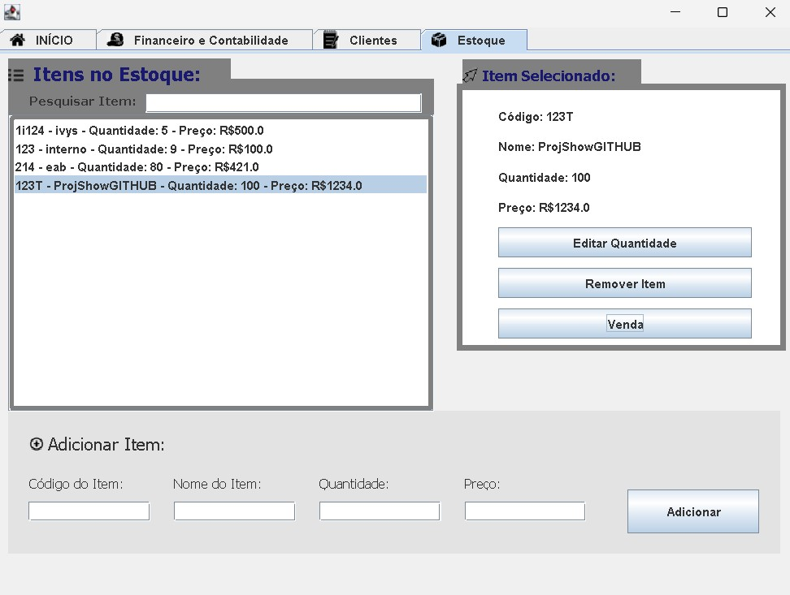

Java.GestãoEmpresarial

Sistema de Gestão Empresarial em Java  
Projeto acadêmico desenvolvido para praticar os conceitos de Programação Orientada a Objetos em um aplicativo completo de gerenciamento de clientes, estoque e transações.

Estrutura do repositório:

* src/  
  • Código-fonte Java organizado em pacotes  
* data/  
  • Arquivos de dados utilizados pela aplicação (ex.: .txt)  
* img/  
  • Recursos de imagem (ícones, logos)  
* lib/  
  • Bibliotecas externas (MigLayout, JGoodies)  
* .project  
  • Configuração de projeto do Eclipse  
* .classpath  
  • Configuração de caminho de classes do Eclipse  
* .gitignore  
  • Lista de arquivos e pastas a serem ignorados pelo Git  

Tecnologias e bibliotecas:

* Java SE 11 ou superior  
* Eclipse IDE (2023-09 ou superior)  
* MigLayout (layout manager para Swing)  
* JGoodies (utilizado no frontend para melhorar componentes Swing e binding)  

Como importar e executar no Eclipse:

1. Clone este repositório:  
   git clone https://github.com/enzoconsulo/Java.GestaoEmpresarial.git  
2. Abra o Eclipse e selecione File → Import…  
3. Escolha General → Existing Projects into Workspace  
4. Aponte para a pasta Java.GestaoEmpresarial e clique em Finish  
5. Se necessário, ajuste o JDK:  
   • Botão direito no projeto → Build Path → Configure Build Path  
   • Na aba Libraries, valide o JRE System Library apontando para Java 11+  
6. Para rodar a aplicação:  
   • No Package Explorer, expanda src/ e localize a classe com método main (nomeado "teste") 
   • Botão direito na classe → Run As → Java Application  

Funcionalidades principais:

* Cadastro e gerenciamento de clientes  
* Controle de estoque (inclusão, alteração e remoção de produtos)  
* Registro de transações (vendas, entradas e saídas de estoque)  
* Interface gráfica em Swing, com frontend construído com JGoodies e MigLayout  

Autor:  
Enzo Consulo  
https://github.com/enzoconsulo  

Licença:  
Sem Licença 

## Capturas de Tela

### Página Inicial  

### Aba Clientes  

### Aba Clientes – Adicionar Dívida  

### Aba Clientes – Pagar Dívida  

### Aba Estoque  

### Aba Estoque – Editar Quantidade  

### Aba Estoque – Venda 1  

### Aba Estoque – Venda 2  

### Aba Estoque – Venda 3  

### Aba Estoque – Venda 4  

### Aba Financeiro  

### Aba Financeiro – Final 1  

### Aba Financeiro – Extrato Filtrado  

